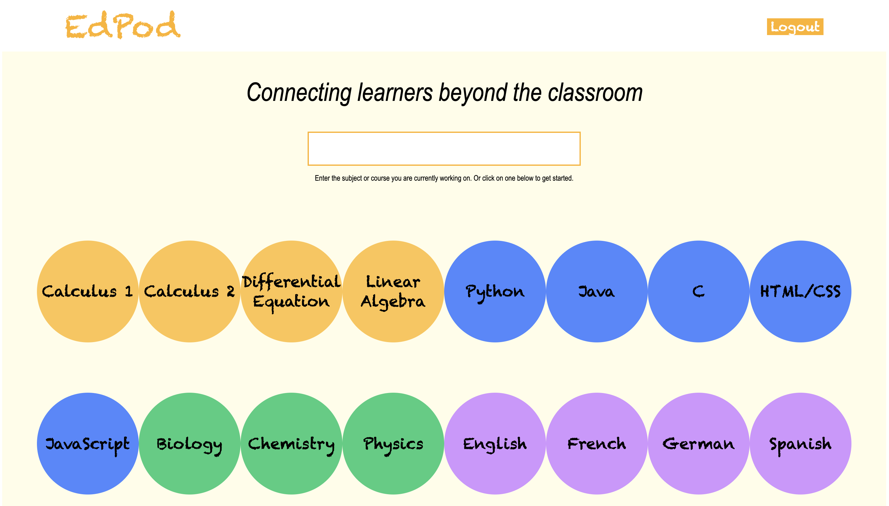
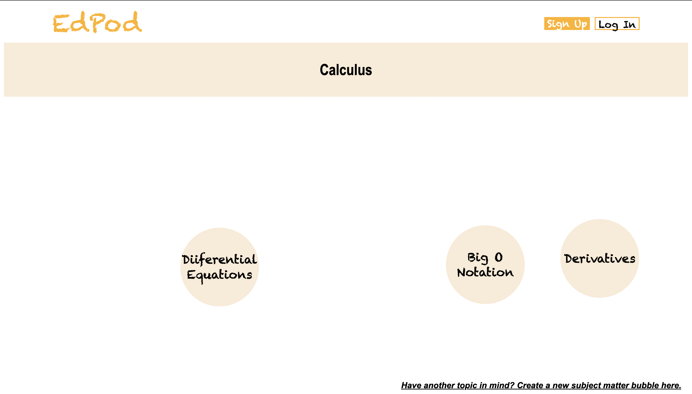

# Welcome to EdPod
- - -
  

Our goal is to connect learners accross the world: https://edpod.herokuapp.com/  

- - -

# Structure

## Landing Page

Our landing page allows you to search any topic you are working on at a time (from sewing to linear algebra). This will 
bring you to a list of rooms already started by other learners! 

## Subtopics

Subtopics are more specific themes you may want to talk about within a larger one. For example, you may be interested in learning about differentiation, or if you are anything like me, you will love a good integration bee! Join the Integration bubble or just 
create it yourself! You will be prompted to add a link to a virtual meeting, so that other learners join you!

- - -

# Improvements

Please feel free to open a GitHub issue if there is any improvement you are thinking about! We are actively improving EdPod 
and would love feedback! :)

